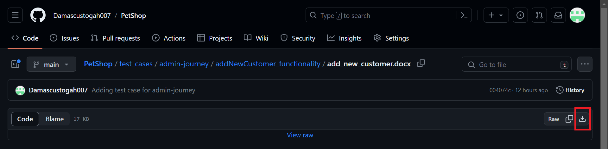

# PetShop
Online store for pets (QA Automation Task)

### Clone repository

To clone repository from vscode terminal, run the following command.

```
git clone https://github.com/Damascustogah007/PetShop.git
```

### Change directory to PetShop

To change directory, run the following command.

```
cd PetShop
```

### Install

To install all dependencies, run the following command.

```
npm install
```

### Open cypress in headless mode

To open cypress headless, run the following command:

```
npm run cypress:run
```

### Open cypress in headed mode (optional)

To open cypress headed, run the following command:

```
npm run cypress:open
```

**Note**: All test scripts has been configured to run on chrome browser

### To download test cases
To download the test cases, follow these steps:
1. Navigate to this url https://github.com/Damascustogah007/PetShop/tree/main/test_cases
2. Click on the **admin-journey** folder 
3. click on the **addNewCustomer_functionality** folder
4. click on the **add_new_customer.docx** file
5. Click on the download raw file icon. 
6. Click on the icon with the **rectangular shape**. see screenshot below

7. Repeat step 1 - 6 for download user-journey test case

**Note** : There are a total of 4 test case for both admin-journey and user-journey.

