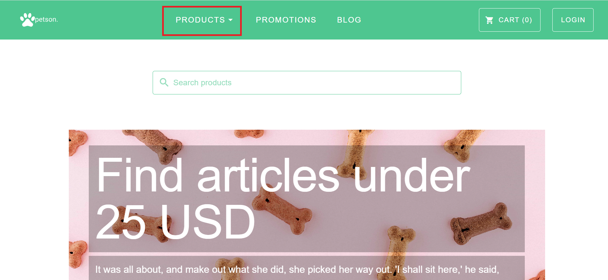

# Bug Reporting
This template helps to ensure that a detailed bug report is written without missing any critical points, which will help the development team to find and fix bugs without facing any challenges.

**The first step is always: Double check if it is a bug or not.**

When creating a bug ticket, the following field should be filled in:

- Status
- Project
- Issues type
- summary
- Issue link
- Description
- Attachment
- Priority
- Assignee

### Status

Status is the present state from which a bug is currently undergoing. 

Below is a list of stages a bug could go through:

- New/Open (Indicate that a bug has been found)
- Fixed (When necessary code changes have been done and the changes have been verified, then he/she can make the bug status as fixed)
- Retest ( ticket is re-assigned to the testing team to check whether the bug has been fixed or not)
- Verified (after retesting, if no bug is found then it changes the status to Verified)
- Closed (If the bug no longer exists, then the ticket is closed)

### Project

This field indicates selecting the right project, where the bug was found on.

### Issues type

The right issue type should be indicated in the field. Ensure that "Bug" is chosen as the issue type.

### Summary

The summary indicates the title of the bug.  Ensure that the summary is reflecting on what the problem is and where it is.

**Note**: The summary should be written in a concise manner so that whoever is supposed to work on the bug ticket will have an idea of the bug from reading the title.

### Issue link

Issue link helps to keep track of duplicate or related work. When a bug already exists the issue link can be used to link or relate the bug ticket created to an existing related bug ticket.

### Description

The description helps provide information to understand the bug created. It describes the problem encountered with precise steps to reproduce a bug.

**The following steps should reflect when writing the description:**  

- Specify the device used  during testing
- Specify the operating system used
- Specify the browser used
- Provide a link to the bug page
- Steps to reproduce
- Indicate test data used during testing.
- Expected result
- Actual result

### Attachment

When creating a bug report a visual proof should be attached as additional documentation. The attached document generally includes screenshots or a video if necessary.

### Priorities

Bug priority refers to how urgent a bug needs to be fixed and eliminated from a website or an application. 

**Below are the levels of prioritizing bugs:**  

- High
- Medium
- Low

Priority	     Definition  

**High**  	    The functionality is business relevant. **(Important and urgent)**

**Medium**  	    The functionality is essential but not business relevant. (Important but not urgent) 

**Low**       	Part of the scope, but can be treated downstream.

**Assignee**

The assignee is the person who has the responsibility to resolve the issue or the person who needs to take the next action.    

By default, the assignee field is set to "Automatic" and can later be assigned to an individual on the project.

## An example bug ticket below

**Summary** : The product dropdown on the landing page does not display the lis of product

### Details

**Status** : "Open"  
**Type** : Bug   
**Priority** : High  
**Assignee** : unassigned  

### People
**Reporter** : Charles Togah

### Descriptioin

**Device Tested On** :  Desktop  
**Operating System** :  Windows 10  
**Browser Tested On**: Chrome Browser  
**URL** : https://pet-shop.buckhill.com.hr

**Steps to Reproduce:** 

1. Navigate to the pet-shop **URL**
2. On the landing page, click on the "PRODUCTS" dropdown at the top of the page

**Expected Result**: When user clicks on the "PRODUCTS" dropdown, it should display the list of products in the pet shop.

**Actual Result**: When the user clicks on the "PRODUCTS" dropdown, it does not display the list of products.  

See the screenshot below.

